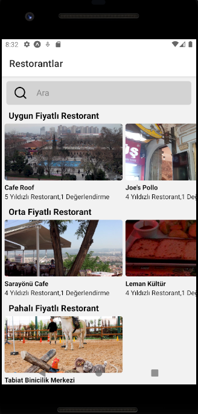
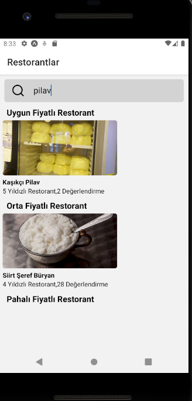
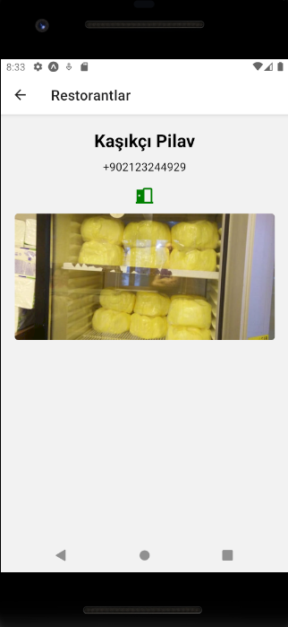

# Restoran Filtreleme Uygulaması

Kullanıcıların restoranları keşfetmesini, fiyatlarına göre filtrelemesini ve menülerindeki ürünlere göre arama yapmasını sağlayan bir React Native mobil uygulamasıdır. Uygulama, restoranların anlık açık/kapalı durumunu da API üzerinden kontrol eder.

## 📱 Ekran Görüntüleri

| Ana Sayfa | Listeleme | Restoran Detayı |
| :---: | :---: | :---: |
|  |  |  | |

## ✨ Özellikler

* Harici bir API (Yelp) üzerinden tüm restoran verileri asenkron olarak çekilir.
* Gelen verilere göre restoranlar "Uygun", "Orta" ve "Pahalı" olarak gruplanır.
* Kullanıcı arama çubuğuna bir ürün yazdığında, restoranlar anlık olarak filtrelenir.
* API'den gelen veriye göre, restoranın açık veya kapalı olduğunu gösteren durum ikonu (yeşil/kırmızı) bulunur.
* Her restoran, kendine ait detay sayfasına sahiptir ve yönlendirme yapılır.

## 🛠️ Kullanılan Teknolojiler

* React Native
* Expo
* JavaScript
* React Navigation
* React Hooks (`useState`, `useEffect`)
* FlatList
* Yelp API
* Postman

## 🚀 Kurulum

Projeyi kendi bilgisayarınızda çalıştırmak için aşağıdaki adımları izleyin:

```bash
# 1. Projeyi klonlayın
git clone [https://github.com/sametoznr/restoran-siralama.git](https://github.com/sametoznr/restoran-siralama.git)

# 2. Proje dizinine gidin
cd restoran-siralama

# 3. Gerekli paketleri yükleyin
npm install

# 4
